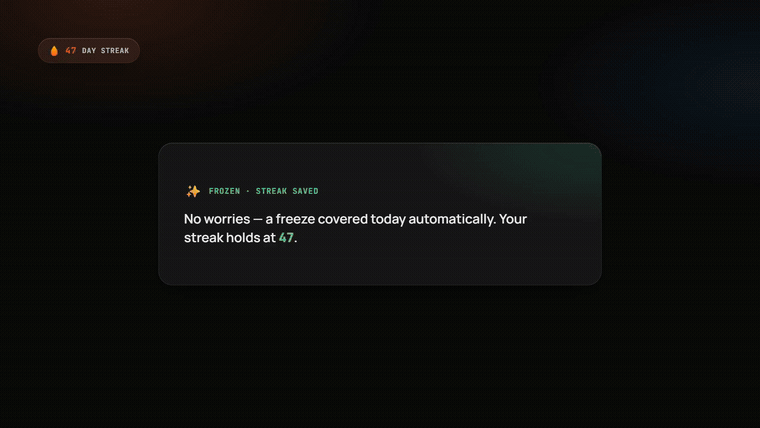

# 🔥 StreakForge

> Track your coding consistency across GitHub and LeetCode — never lose the chain by accident.

StreakForge pulls your contribution data from GitHub and LeetCode, maintains a daily streak counter, and protects it with **freeze credits** and a **24-hour repair window** so a missed day, timezone edge case, or one bad night doesn't wipe out real progress. It's a dark liquid-glass UI, installable as a mobile PWA, with push notifications and email reminders — see `AGENTS.md` for the full architecture.



*([full quality with audio](brag-output/brag.mp4))*

## Features

- 🔥 **Live Streak Counter** — tracks consecutive days you've coded, synced across devices via your account
- 🧊 **Freeze Credits** — auto-applied on a missed day (earns more at milestones)
- 🩹 **Streak Repair** — out of freezes? a 24h grace window plus a monthly repair credit before it actually resets
- 📅 **Activity Calendar** — full-year GitHub-style contribution heatmap, themed to the app
- 🎯 **Daily Goals** — visual checkmark when you've hit both platforms today
- 🪟 **Liquid-glass UI** — frosted translucent panels, installable as a mobile PWA
- 🔔 **Push notifications + email reminders** — nudges you before your streak is at risk
- 😌 **Stress buster** — a "need a breather?" card that lets you throw a few emoji at the screen
- ⚙️ **Zero-friction setup** — just your GitHub and LeetCode usernames, no token to manage

## Tech Stack

| Layer | Technology |
|-------|-----------|
| Frontend | React 18 + Vite, installable PWA |
| Backend | Supabase (Postgres, Auth, Edge Functions, pg_cron) |
| Email | Resend |
| Deploy | Vercel (static frontend) + Supabase (everything server-side) |

## Local Development

```bash
npm install
npm run dev
```

Visit `http://localhost:5173`.

## Environment Variables

Copy `client/.env.example` to `client/.env.local` and fill in your Supabase project's URL and anon key (Project Settings → API in the Supabase dashboard).

Server-side secrets (never in client env files — set via `supabase secrets set`):

| Secret | Used by |
|---|---|
| `GITHUB_APP_TOKEN` | `sync-activity`, `daily-streak-check` — one low-scope PAT owned by the project, not per-user |
| `RESEND_API_KEY`, `RESEND_FROM` | `daily-streak-check` reminder emails, and Supabase Auth's custom SMTP |
| `VAPID_PUBLIC_KEY`, `VAPID_PRIVATE_KEY`, `VAPID_SUBJECT` | Web Push; the public key is also exposed to the client as `VITE_VAPID_PUBLIC_KEY` |

## Supabase Setup

```bash
npx supabase login
npx supabase link --project-ref <your-project-ref>
npx supabase db push                      # applies supabase/migrations/
npx supabase functions deploy sync-activity
npx supabase functions deploy daily-streak-check
npx supabase secrets set GITHUB_APP_TOKEN=... RESEND_API_KEY=... RESEND_FROM=... VAPID_PUBLIC_KEY=... VAPID_PRIVATE_KEY=... VAPID_SUBJECT=mailto:you@example.com
```

Then run `supabase/setup/schedule-cron.sql` once in the Supabase SQL editor (fill in your project ref and service-role key first — see that file's header) to wire up the 15-minute scheduled check.

Full proof-it-works commands: `docs/VERIFY.md`.

## Deployment

- Frontend: Vercel, static build (`vercel.json` builds `client/` and serves `client/dist`).
- Everything server-side (auth, data, scheduled checks, notifications) runs on Supabase — there is no Node/Express server or Vercel serverless API anymore.

[](https://vercel.com/new/clone?repository-url=https://github.com/JamesKevinJones/streakforge)

## License

MIT
